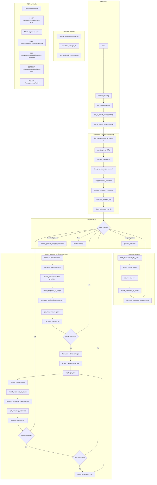

# mb-acoustix

Automates per-speaker EQ and level matching using [Magic Beans True Target](https://magicbeansaudio.com/products/true-target) curves for [A1 Evo Acoustix](https://youtu.be/QvL7ZhcV0dc?si=3aUPcb6difRH4-Ge) Custom EQ via the Room EQ Wizard (REW) HTTP API.

## Overview

When using A1 Evo Acoustix with Custom EQ, each speaker channel requires individual EQ filters matched to Magic Beans Unified Sound Field target curves. This script automates the tedious manual process by:

1. Processing each speaker's measurement against its channel-specific Magic Beans target curve
2. Level-matching all speakers to the Front Left (FL) reference by iteratively adjusting target levels until the 500Hz-2kHz average matches within 0.1 dB tolerance
3. Generating predicted measurements that can be exported as Custom EQ filters for A1 Evo Acoustix

This ensures a cohesive Unified Sound Field across all channels with consistent levels—critical for proper Atmos/DTS:X immersion.

## Requirements

- **Python 3.10+** with [uv](https://docs.astral.sh/uv/) package manager
- **Room EQ Wizard (REW)** running with API enabled:
  ```bash
  java -jar REW.jar -api
  ```
- Existing measurements in REW for each speaker channel
- **Magic Beans Unified Sound Field target curves** for each speaker in the `magic-beans/` directory (exported from Magic Beans as per-channel house curves)

## Installation

```bash
# Clone the repository
git clone <repository-url>
cd mb-acoustix

# Install dependencies
uv sync
```

## Usage

1. Start REW with the API flag:
   ```bash
   java -jar REW.jar -api
   ```

2. Load your speaker measurements into REW with names matching the configuration:
   - `FLfinal` - Front Left (reference speaker)
   - `FRfinal` - Front Right
   - `FDLfinal` - Front Height Left
   - `FDRfinal` - Front Height Right
   - `SLAfinal` - Surround Back Left
   - `SRAfinal` - Surround Back Right

3. Run the automation script:
   ```bash
   uv run rew_automate.py
   ```

## How It Works

The script processes speakers in two categories:

### Reference Speaker (FL)
- Processes Front Left first as the reference
- Applies house curve and generates EQ filters
- Calculates the 500Hz-2kHz average dB level as the target for all other speakers

### Level-Matched Speakers (FR, SLA, SRA)
- Uses a two-phase approach for efficient convergence:
  1. **Initial estimate**: Generates a predicted measurement at the reference target level, calculates the offset from reference, and jumps directly to the estimated target level
  2. **Fine-tuning**: Iterates in 0.1 dB steps until the predicted measurement matches the reference within tolerance (0.1 dB)

### Height Speakers (FDL, FDR)
- Skip level matching due to their limited frequency range (20-1000Hz)
- Still receive EQ processing but maintain the reference target level

## Architecture

```
mb-acoustix/
├── rew_automate.py      # Main automation script
├── magic-beans/         # Magic Beans Unified Sound Field target curves per speaker
│   ├── Filters for Front Left.txt
│   ├── Filters for Front Right.txt
│   ├── Filters for Front Height Left.txt
│   ├── Filters for Front Height Right.txt
│   ├── Filters for Surround Back Left.txt
│   └── Filters for Surround Back Right.txt
├── rew-api.md           # REW API documentation
├── pyproject.toml       # Project dependencies
└── uv.lock              # Locked dependencies
```

## Function Flow



## Key Functions

| Function | Description |
|----------|-------------|
| `main()` | Entry point; orchestrates the entire level-matching workflow |
| `enable_blocking()` | Enables synchronous API mode so operations complete before returning |
| `get_measurements()` | Retrieves all measurements from REW |
| `find_measurement_by_name()` | Locates a measurement UUID by its title |
| `select_measurement()` | Sets the active measurement in REW |
| `set_house_curve()` | Applies a Magic Beans target curve file to EQ processing |
| `match_response_to_target()` | Generates EQ filters to match the target curve |
| `generate_predicted_measurement()` | Creates a predicted response based on EQ filters |
| `get_frequency_response()` | Fetches frequency response data from REW |
| `decode_frequency_response()` | Decodes Base64-encoded 32-bit big-endian floats |
| `calculate_average_db()` | Computes RMS average dB in a frequency range |
| `get_target_level()` / `set_target_level()` | Gets/sets the target level for a measurement |
| `process_speaker()` | Processes a single speaker without level matching |
| `match_speaker_level_to_reference()` | Two-phase level matching algorithm |
| `find_predicted_measurement()` | Finds the "EQ {name}" predicted measurement |
| `delete_measurement()` | Removes a measurement from REW |

## Configuration

### Filter Tasks Settings

The script configures REW's match-target settings:

| Setting | Value |
|---------|-------|
| Match Range | 20 - 20,000 Hz |
| Individual Max Boost | 6 dB |
| Overall Max Boost | 6 dB |
| Flatness Target | 1 dB |
| Allow Low Shelf | -3 to 3 dB |
| Allow High Shelf | -3 to 3 dB |
| Allow Narrow Filters Below 200 Hz | Yes |
| Vary Max Q Above 200 Hz | Yes |

### Height Speaker Settings

Height speakers (FDL, FDR) use a restricted frequency range:
- End Frequency: 1000 Hz (instead of 20,000 Hz)
- Skip level matching (limited frequency content for accurate matching)

## REW API Notes

- The API is served at `http://127.0.0.1:4735` when REW runs with `-api`
- Blocking mode ensures operations complete synchronously
- Frequency response data is Base64-encoded 32-bit big-endian floats
- Measurements are accessed by UUID (preferred) or index
- Predicted measurements are automatically named "EQ {original_name}"

See `rew-api.md` for complete API documentation.

## License

MIT
